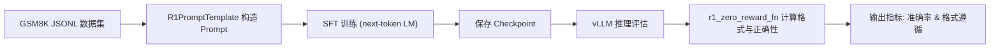

# 从 1.56% 到 62.9%：SFT 推理微调实践

> 读完这篇文章，你将用监督微调（SFT）把一个 1.5B 规模的数学模型在 GSM8K 上的零样本推理正确率从 **1.56% → 62.9%**，同时把输出格式遵循率从 **18.9% → 100%**。我们将完整走通数据集下载、Prompt 架构、训练配置和评估方法，所有代码均来自本仓库 alignment 文件夹，保证可复现与透明。

本文将深入剖析 [llm-from-scratch](https://github.com/fangpin/llm-from-scratch) 仓库中 `alignment` 模块，展示 SFT 的完整流程。

## 引言

大语言推理模型常见的两个痛点：一是“答不对”，二是“答不规范”。前者意味着推理链条断裂或迁移失效，后者则让后续评估与系统对接步步惊心。

在这篇 How‑to 指南里，我们用 GSM8K 的标准数据与明确的评估规则，让 **Qwen/Qwen2.5-Math-1.5B** 通过 SFT 后,能力迁移到不同的数据集上, 学会“思考→作答”的结构化输出：不仅更常答对，也更懂规范。结果来自实测，**正确率由 1.56% 提升到 62.9%，格式遵循由 18.9% 提升到 100%**.

---

## 为什么零样本推理和“格式遵循”都很难？

- 零样本推理难在“迁移”：模型虽见过大量文本，但缺少对“分步算术、单位处理、等式化简”的系统化经验，容易在多步推理或细节规范上出错。
- 格式遵循难在“约束学习”：即使模型知道答案，若不按系统约定的输出协议（例如必须有 `<think>...</think> <answer>...</answer>`），评估与下游解析都会失败。
- 两者耦合：不遵循格式会直接“判零分”，即使答案正确；而缺少分步推理（think）又会影响最终答案（answer）的稳定性。

一个好比喻：把模型想象成一个聪明但散漫的学生。零样本时，它能“蒙”对少数题；SFT 就像班主任的“规范化带教”，教它先写草稿（<think>）再交最终答案（<answer>），且必须按卷面格式来——这样既能提高质量，也能让阅卷更可靠。

---

## 核心概念与评估口径

- 监督微调（SFT）：用标注样本（这里是 GSM8K 的“问题 + 推理过程 + 最终答案”）对模型做下一 token 预测训练。通过标签掩码，只对“推理与答案”部分计算损失，指导模型输出完整的思维链与答案。
- Prompt 架构：我们采用 R1 风格模板，强制输出 `<think>` 和 `<answer>` 标签，保证格式可解析：
  - `<think> ... </think>`：推理过程
  - `<answer> ... </answer>`：最终答案
- 训练目标（Loss Target）：标准自回归语言模型（next-token LM）损失，但只在“回应（think+answer）”区间计算，避免模型学习到重复的“系统提示与问题”的 token 序列。
- 评估指标：
  - “推理准确率”：按每条样本的 **答案是否正确**（数学同值、LaTeX 等价、数值等价，详见 grader）计分 0/1，最后取平均。
  - “格式遵循率”：按每条样本 **是否包含合法的 `<think>...</think> <answer>...</answer>`** 标签计分 0/1，最后取平均。

我们在 alignment/drgrpo_grader.py 中实现了严格的格式检查与宽容但可靠的数学等价判断（符号化、数值化与 LaTeX 解析的组合），是本文准确率与格式遵循的核心评估逻辑。

---

## 方案与架构

本文的流水线架构如下：从 GSM8K JSONL 到 Prompt 构造，再到 SFT 训练与 vLLM 推理评估，最后汇总指标（准确率/格式遵循）。



关键路径对应的源码均在 alignment 目录下：dataset.py（数据加载）、r1_prompt.py（模板）、sft.py（训练）、evaluate.py（评估）、drgrpo_grader.py（格式与答案打分）。

---

## 可复现配置与注意事项

- 模型与精度：默认使用 **Qwen/Qwen2.5-Math-1.5B**，dtype 默认 **bfloat16**（见 alignment/args.py）。
- 设备与显存：alignment/sft.py 通过 accelerate 的 `infer_auto_device_map` 自动切分模型到多卡（`--sft_device`），并设置 `--max_sft_gpu_memory_use`（默认 31GiB/卡）。评估使用 vLLM 独立进程（`--eval_device`）。
- 随机性：`--seed` 默认 42。不同环境（驱动、库版本、显存压力）与随机种子可能导致轻微波动。
- 批次与累积：`--batch_size` 与 `--gradient_accumulation_steps` 控制有效批次大小，训练日志会打印累计后的损失。
- 提示模板：`alignment/prompts/r1_zero.prompt` 强制 `<think>/<answer>` 标签，保证格式可检。

---

## 实践步骤：从数据到评估与训练

1) 下载 GSM8K（train/test）到本地 data 目录（可根据你的项目目录调整）：

```bash
cd dataset
wget https://raw.githubusercontent.com/openai/grade-school-math/master/grade_school_math/data/train.jsonl
wget https://raw.githubusercontent.com/openai/grade-school-math/master/grade_school_math/data/test.jsonl
```

建议将文件移动/复制为仓库约定路径：`data/gsm8k/train.jsonl` 与 `data/gsm8k/test.jsonl`（alignment/args.py 默认如此）。

2) 微调前的零样本评估（使用 vLLM + R1 模板 + 严格格式与答案打分）：

```bash
uv run -m alignment.evaluate
```

3) 执行 SFT 训练并在测试集上评估（训练中每个 epoch 结束都会评估并保存 checkpoint）：

```bash
uv run -m alignment.sft
```

---

## 代码讲解：数据加载与样本构造（包含 <think>/<answer> 标签）

首先用 R1 模板将问题转为 Prompt，将“推理过程 + 最终答案”打包为监督信号。alignment/dataset.py 与 r1_prompt.py 如下：

```python
# alignment/dataset.py
from torch.utils.data import Dataset
import json
from .r1_prompt import R1PromptTemplate

class Gsm8kDataset(Dataset):
    def __init__(self, data_path: str, promt_template_path: str):
        template = R1PromptTemplate(promt_template_path)
        self.data = []
        self.label = []
        self.ground_truth = []
        with open(data_path, "r") as f:
            lines = f.readlines()
        for line in lines:
            qa = json.loads(line)
            question = qa["question"]
            answer_think = qa["answer"]
            think, answer = answer_think.split("####")
            think, answer = think.strip(), answer.strip()
            self.data.append(template.gen_prompt(question))
            self.label.append(template.gen_response(think, answer))
            self.ground_truth.append(answer)

    def __len__(self):
        return len(self.data)

    def __getitem__(self, idx):
        return self.data[idx], self.label[idx], self.ground_truth[idx]
```

```python
# alignment/r1_prompt.py（关键：强制 <think>/<answer> 标签）
class R1PromptTemplate:
    def __init__(self, template_path: os.PathLike):
        with open(template_path, "r") as f:
            self.template = f.read().strip()

    def gen_prompt(self, question: str) -> str:
        return self.template.replace(r"{question}", question)

    def gen_response(self, think: str, answer: str) -> str:
        return think + "</think>" + " <answer>" + answer + " </answer>"
```

模板文件 alignment/prompts/r1_zero.prompt：

```text
A conversation between User and Assistant... <think> reasoning process here </think> <answer> answer here </answer>.
User: {question}
Assistant: <think>
```

这保证了训练时模型学习“先写 `<think>` 再写 `<answer>`”，评估时也能稳定抽取并验证答案。

---

## 代码讲解：SFT 训练循环与标签掩码（只对回应部分计算损失）

在 alignment/sft.py，我们将 prompt + completion 拼接，对 prompt 区间的 label 置为 -100，从而让交叉熵只在“回应（think + answer）”上回传梯度：

```python
# alignment/sft.py（节选）
model.train()
for epoch in range(args.epochs):
    for i, batch in enumerate(train_data_loader):
        prompts, completions, _ = batch

        full_texts = [p + c + tokenizer.eos_token for p, c in zip(prompts, completions)]
        inputs = tokenizer(
            full_texts,
            return_tensors="pt",
            padding=True,
            truncation=True,
            max_length=args.max_seq_len,
        ).to(model.device)

        # 计算每个样本的 prompt token 长度
        prompt_tokens = tokenizer(list(prompts), add_special_tokens=False)
        prompt_lengths = [len(ids) for ids in prompt_tokens.input_ids]

        labels = inputs.input_ids.clone()
        for idx in range(len(prompts)):
            prompt_len = prompt_lengths[idx]
            labels[idx, :prompt_len] = -100  # 对 prompt 部分不计 loss

        # Mask padding tokens
        labels[labels == tokenizer.pad_token_id] = -100

        outputs = model(
            input_ids=inputs.input_ids,
            attention_mask=inputs.attention_mask,
            labels=labels,
        )
        loss = outputs.loss
        loss = loss / args.gradient_accumulation_steps
        loss.backward()

        if (i + 1) % args.gradient_accumulation_steps == 0:
            print(f"Epoch {epoch}, Iteration {i}, Loss: {loss.item() * args.gradient_accumulation_steps}")
            optimizer.step()
            optimizer.zero_grad()

    # 评估：将策略权重加载到 vLLM 并在测试集上跑评估
    load_policy_into_vllm_instance(model, eval_model)
    evaluate_math(
        eval_model,
        args.prompt_template_path,
        args.sft_test_data,
        args.batch_size,
        log_sample=True,
    )
    model.save_pretrained(args.checkpoint_path)
```

这段逻辑实现了标准的 SFT：用“回应”作为监督目标，配合累积梯度与分卡策略，保证 1.5B 规模模型在可控显存与吞吐下完成训练。

---

## 代码讲解：评估与指标计算（准确率与格式遵循）

评估由 alignment/evaluate.py 驱动，调用 r1_zero_reward_fn 计算每条样本的格式与答案得分：

```python
# alignment/evaluate.py（核心）
from collections.abc import Callable
from vllm import LLM, SamplingParams
from .drgrpo_grader import r1_zero_reward_fn

def evaluate_vllm(vllm_model: LLM,
                  reward_fn: Callable[[str, str], dict[str, float]],
                  prompts: list[str],
                  ground_truths: list[str],
                  eval_sampling_params: SamplingParams,
                  log_sample: bool) -> dict:
    outputs = vllm_model.generate(prompts, eval_sampling_params)
    generated_texts = [output.outputs[0].text for output in outputs]
    rewards = [reward_fn(generated_text, ground_truth)
               for generated_text, ground_truth in zip(generated_texts, ground_truths)]

    avg_format_rewards = sum([r["format_reward"] for r in rewards]) / len(prompts)
    avg_answer_rewards = sum([r["answer_reward"] for r in rewards]) / len(prompts)
    avg_all_rewards = sum([r["reward"] for r in rewards]) / len(prompts)
    print(f"avg_format_rewards: {avg_format_rewards}")
    print(f"avg_answer_rewards: {avg_answer_rewards}")
    print(f"avg_all_rewards: {avg_all_rewards}")
    return {
        "avg_format_rewards": avg_format_rewards,
        "avg_answer_rewards": avg_answer_rewards,
        "avg_all_rewards": avg_all_rewards,
    }
```

奖励函数严格要求格式标签，并对答案进行多重等价校验：

```python
# alignment/drgrpo_grader.py（节选）
def r1_zero_reward_fn(response, ground_truth, fast=True):
    # 格式严格：必须包含 </think> <answer> ... </answer>
    if "</think> <answer>" in response and "</answer>" in response:
        model_answer = response.split("<answer>")[-1].replace("</answer>", "")
        # 允许 \boxed{...} 的答案形式并抽取
        if "\\boxed" in model_answer:
            model_answer = extract_answer(model_answer)
            if model_answer is None:
                return {"format_reward": 1.0, "answer_reward": 0.0, "reward": 0.0}
        # 字符串、数值、LaTeX、SymPy 等价综合判断
        is_correct = grade(model_answer, str(ground_truth), fast)
        if is_correct:
            return {"format_reward": 1.0, "answer_reward": 1.0, "reward": 1.0}
        else:
            return {"format_reward": 1.0, "answer_reward": 0.0, "reward": 0.0}
    else:
        # 不符合格式：直接判 0 分（同时 answer_reward 也为 0）
        return {"format_reward": 0.0, "answer_reward": 0.0, "reward": 0.0}
```

因此：

- **格式遵循率** = 所有样本的 `format_reward` 平均值。
- **推理准确率** = 所有样本的 `answer_reward` 平均值（在格式正确的前提下计算答案是否等价）。

数据读取与 Ground Truth 解析（alignment/evaluate.py）：

```python
# alignment/evaluate.py（节选）
def get_gsm8k_test_data(test_data_path: os.PathLike) -> list[dict]:
    data = []
    with open(test_data_path, "r") as f:
        for line in f.readlines():
            obj = json.loads(line.strip())
            ts = obj["answer"].split("####")
            if len(ts) != 2:
                print(f"invalid answer: {obj['answer']}")
                continue
            data.append({"question": obj["question"],
                         "think": ts[0].strip(),
                         "answer": ts[1].strip()})
    return data
```

---

## 结果与讨论

在同一评估口径下，我们在 GSM8K 上得到如下对比（报告值）：

| 指标 | 微调前（零样本） | SFT 微调后 |
|---|---:|---:|
| 推理准确率 | **1.56%** | **62.9%** |
| 格式遵循率 | **18.9%** | **100%** |

说明：

- 上述结果是在 alignment.evaluate 与 alignment.sft 的评估框架下得到的报告值。不同硬件/软件环境与随机种子可能引起轻微差异。
- “格式遵循率”达到 100% 的关键是训练时的模板约束与监督信号覆盖 `<think>/<answer>`，并在奖励函数中严格判定标签存在性。

---

## 常见问题与优化建议

- 训练不收敛或损失震荡：适当降低学习率（如 1e‑5 → 5e‑6）、增大 `gradient_accumulation_steps`，或提高 `max_seq_len` 以覆盖完整推理链。
- 显存不足：增加 `--sft_device` 的卡数或调大 `--max_sft_gpu_memory_use`，必要时裁剪序列长度或使用更小 batch。
- 评估速度慢：调小 `SamplingParams` 的 `max_tokens`；但过小的生成长度会影响完整 `<think>/<answer>` 输出与正确率。
- 格式仍偶发不合规：检查模板与数据是否一致（是否始终以 `<think>` 开头），并确保 SFT 标签覆盖足量样本。

---

## 结论

通过对 **Qwen/Qwen2.5-Math-1.5B** 在 **GSM8K** 上的监督微调，我们实现了两条主线的同步提升：

- 推理链条更稳，**零样本正确率从 1.56% 提升到 62.9%**；
- 输出规范更强，**格式遵循率从 18.9% 提升到 100%**。

这背后的关键是“结构化输出模板 + 只对回应部分计损失 + 严格但宽容的评估规则”。如果你也在做数学推理或其他需要“思考‑答案二段式”输出的任务，强烈建议复用本文的架构与代码。

行动号召：现在就下载 GSM8K，跑一遍 `uv run -m alignment.evaluate` 与 `uv run -m alignment.sft`，观察你本地的改进幅度吧！
可以参考 [llm-from-scratch](https://github.com/fangpin/llm-from-scratch) 仓库中 `alignment` 模块，对照进行学习。

开放问题：在你的场景里，是否遇到过“答案正确但格式导致系统解析失败”的案例？你是如何设计模板与评估逻辑来避免它的？欢迎在评论区分享你的经验与挑战。
