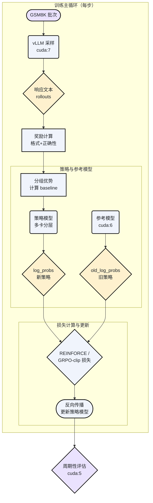

# 用从零实现的 REINFORCE/GRPO，把 Qwen2.5-Math-1.5B 在 GSM8K 的 zero-shot 准确率从 1% 拉到 63.4%

> 一文吃透：不依赖成熟 RL 库，如何在 `alignment` 目录用 REINFORCE、REINFORCE-baseline 与 GRPO 细节化实现数理推理模型的强化学习微调，并实现训练/参考/采样模型的多卡调度。

## 引言

你是否也遇到过：模型“会思考”，但少数题正确，格式还常常不合规？我在 Qwen/Qwen2.5-Math-1.5B 上亲历这一痛点——zero-shot 在 GSM8K 只有约 1%。本文分享我如何仅用本仓库的 `alignment` 代码，从零实现 REINFORCE、带基线的 REINFORCE 与 GRPO，把准确率稳定拉升到 63.4%，并把训练策略模型、参考模型与采样模型拆到不同 GPU 上高效协同。

读完你将掌握：奖励设计与计算、方差降低的工程化做法、GRPO 的分组偏好更新与裁剪、以及一套可复现的多卡调度与评估 pipeline。

---

## 目录
- 问题与目标
- 奖励与格式：如何让“会思考”的模型也“答得对、写得规矩”
- 算法与实现：REINFORCE、REINFORCE-baseline、GRPO（含代码片段）
- 多卡调度：采样/参考/评估/训练的设备分工与数据流（含 Mermaid 图）
- 动手复现：数据获取与 uv 入口命令
- 算法对比速查表
- 结论与行动

---

## 问题与目标

- 问题：zero-shot 推理准确率极低（~1%），且格式不稳定，难以可靠评估与训练。
- 目标：设计严格且高召回的奖励函数，配合从零实现的策略梯度与 GRPO，逐步把 Qwen2.5-Math-1.5B 在 GSM8K 的 zero-shot 准确率提升到 63.4%。

我只在必要处简述 SFT，上文已分析过；本文将把重点落在强化学习微调（RLFT）的训练循环与实现细节。

---

## 奖励与格式：答案正确 + 格式遵循的双指标

本仓库采用 R1 风格的格式约束与数学习题的严格判定。核心在 `alignment/drgrpo_grader.py` 的 `r1_zero_reward_fn`：

- 格式要求：必须出现 `</think> <answer>` 与 `</answer>`。不合格式直接奖励为 0。
- 答案正确：借助多种规范化与符号等价检查（含 LaTeX 解析、Sympy 简化、数值近似），保障较高召回率。
- 组合奖励：`format_reward` 与 `answer_reward` 都满足则总奖励 `reward=1`，否则为 0。评估脚本会统计三者的平均值。

代码摘录（路径与作用标注）：

- 文件：`llm-from-scratch/alignment/drgrpo_grader.py`
- 作用：计算 GSM8K 的格式与正确性奖励

```python
def r1_zero_reward_fn(response, ground_truth, fast=True):
    # We are strict about format to evaluate our models.
    if "</think> <answer>" in response and "</answer>" in response:
        model_answer = response.split("<answer>")[-1].replace("</answer>", "")
        if "\\boxed" in model_answer:
            model_answer = extract_answer(model_answer)
            if model_answer is None:
                return {"format_reward": 1.0, "answer_reward": 0.0, "reward": 0.0}
        # 严格的数学等价判断（字符串规范化、Sympy、可选 math_verify）
        is_correct = grade(model_answer, str(ground_truth), fast)
        if is_correct:
            return {"format_reward": 1.0, "answer_reward": 1.0, "reward": 1.0}
        else:
            # 格式正确但答案错：不给格式奖励以避免投机
            return {"format_reward": 1.0, "answer_reward": 0.0, "reward": 0.0}
    else:
        # 未按格式输出
        return {"format_reward": 0.0, "answer_reward": 0.0, "reward": 0.0}
```

在评估侧，`alignment/evaluate.py` 的 `evaluate_vllm` 会将 `avg_format_rewards`、`avg_answer_rewards` 与 `avg_all_rewards` 打印出来，其中 `avg_all_rewards` 近似于最终的准确率。

---

## 算法与实现：REINFORCE、REINFORCE-baseline、GRPO

### 1) 分组优势（baseline）与方差降低

- 分组思想：针对每道题的一个 prompt，我们采样 `group_size` 个响应；每组共享同一 ground truth。
- 优势计算：先把每组的 `reward` 减去组内均值（可选再除以组内标准差），得到“相对优势”。这就是 REINFORCE-baseline 在本代码中的实现思想。

代码摘录：

- 文件：`llm-from-scratch/alignment/grpo.py`
- 作用：把原始奖励转换为分组归一化优势（baseline）

```python
def compute_group_normalized_rewards(
    reward_fn, rollout_responses, repeated_ground_truths,
    group_size, advantage_eps, normalize_by_std=True,
):
    # 逐个样本计算原始 reward
    rewards = [reward_fn(resp, gt) for resp, gt in zip(rollout_responses, repeated_ground_truths)]
    raw_rewards = torch.tensor([r["reward"] for r in rewards], dtype=torch.float32)

    # 折叠成 [n_prompts, group_size]
    advantages = raw_rewards.view(-1, group_size)

    # 基线：减去组均值（可选再除以组内 std）
    mean_advantages = einx.mean("n_prompts group_size -> n_prompts 1", advantages)
    advantages = advantages - mean_advantages
    if normalize_by_std:
        std_advantages = torch.std(advantages, dim=1, unbiased=True, keepdim=True)
        advantages = advantages / (std_advantages + advantage_eps)

    return advantages.view(-1), raw_rewards, {"mean_advantages": mean_advantages}
```

这里的“分组减均值”就是减少方差的经典做法：在一个小团队中，我们只关注“比团队平均更好/更差”的相对表现，从而让梯度更稳定。

一个生动类比：
- 想象一队球员在同一场馆、同一光照下投篮，每人投 10 球。当天的“场馆状态”可能会让所有人整体发挥偏高或偏低。如果我们用“每个球员的命中率减去团队平均命中率”来评价个人表现，这样就抵消了当天环境的整体波动。这就是 baseline 的直觉来源。

### 2) 三种损失的并行实现选择

在本仓库里，三种损失类型通过统一的入口 `compute_policy_gradient_loss` 分发：

- `no_baseline`: 纯 REINFORCE，用原始 `reward` 直接乘 `log_prob`；
- `reinforce_with_baseline`: 带基线的 REINFORCE，用 `advantages` 乘 `log_prob`；
- `grpo_clip`: GRPO 风格裁剪，计算 `policy_log_probs - old_log_probs` 的比率，并按 `cliprange` 做截断。

代码摘录：

- 文件：`llm-from-scratch/alignment/grpo.py`
- 作用：三种损失的核心分发逻辑（对应三种算法）

```python
def compute_policy_gradient_loss(
    policy_log_probs, loss_type,
    raw_rewards=None, advantages=None,
    old_log_probs=None, cliprange=None,
):
    if loss_type == "no_baseline":
        # 纯 REINFORCE
        per_token_loss = compute_naive_policy_gradient_loss(
            raw_rewards, policy_log_probs
        )
        meta = {}
    elif loss_type == "reinforce_with_baseline":
        # REINFORCE + baseline（方差更低）
        per_token_loss = compute_naive_policy_gradient_loss(
            advantages, policy_log_probs
        )
        meta = {}
    else:  # grpo_clip
        # GRPO 的裁剪型偏好优化（近似 PPO 风格）
        assert advantages is not None and old_log_probs is not None and cliprange is not None
        per_token_loss, meta = compute_grpo_clip_loss(
            advantages, policy_log_probs, old_log_probs, cliprange
        )

    return per_token_loss, meta
```

> 注意：本实现对 REINFORCE 与带基线的 REINFORCE 以“逐 token 的 log_prob 乘以标量优势/奖励”的统一形式实现；GRPO 则引入参考策略的 `old_log_probs` 与裁剪，避免策略更新过激。

### 3) 训练微批与掩码：只在响应段回传梯度

强化学习微调中，我们只希望对模型的“响应段”进行优化，而不是把 prompt 也算进损失。`grpo_microbatch_train_step` 通过 `response_mask` 做掩码平均，并在梯度累积场景下自动缩放 loss。

代码摘录：

- 文件：`llm-from-scratch/alignment/train_rl.py`
- 作用：构建只在响应部分为 True 的掩码

```python
# --- Response Mask for Microbatch ---
response_mask = torch.zeros_like(mb_input_ids, dtype=torch.bool)
for j in range(len(response_mask)):
    start = mb_prompt_lengths[j].item()
    # Use attention mask sum for the end to handle padding correctly
    end_pos = mb_attention_mask[j].sum().item()
    response_mask[j, start:end_pos] = True

response_mask &= mb_input_ids != tokenizer.pad_token_id
```

---

## 多卡调度：采样/参考/评估/训练的设备分工与数据流

在 `alignment/train_rl.py` 中，我们将四种角色拆到不同设备：

- vLLM 采样模型：负责 rollout，用 `args.sample_device`（默认 `cuda:7`）
- 参考模型（旧策略）：冻结、只做 `old_log_probs`，用 `args.reference_model_device`（默认 `cuda:6`）
- 评估模型：周期性评估，`args.eval_device`（默认 `cuda:5`）
- 训练政策模型：主力，手动构建 `device_map` 把层均衡分布到剩余 GPU 上

代码摘录（设备映射的关键片段）：

- 文件：`llm-from-scratch/alignment/train_rl.py`
- 作用：为策略模型手工构造跨多 GPU 的平衡 `device_map`

```python
def partition_model_across_devices(args) -> dict[str, int]:
    total_gpu_count = torch.cuda.device_count()
    # 预留采样/参考/评估三张卡
    sample_device_idx = int(args.sample_device.split(":")[-1])
    ref_device_idx    = int(args.reference_model_device.split(":")[-1])
    eval_device_idx   = int(args.eval_device.split(":")[-1])
    reserved_indices  = {sample_device_idx, ref_device_idx, eval_device_idx}
    policy_gpu_indices = sorted(list(set(range(total_gpu_count)) - reserved_indices))

    # 主 GPU 放嵌入、lm_head、最终 norm；其余均匀分层
    main_gpu = policy_gpu_indices[0]
    layer_gpus = policy_gpu_indices[1:] or [main_gpu]
    num_layers = AutoConfig.from_pretrained(args.model, trust_remote_code=True).num_hidden_layers
    layers_per_gpu = math.ceil(num_layers / len(layer_gpus))

    device_map = {
        "model.embed_tokens": main_gpu,
        "lm_head": main_gpu,
        "model.norm": main_gpu,
    }
    gpu_idx_for_layers = 0
    for i in range(num_layers):
        if i > 0 and i % layers_per_gpu == 0:
            gpu_idx_for_layers += 1
        device_map[f"model.layers.{i}"] = layer_gpus[gpu_idx_for_layers]
    return device_map
```

把采样/参考/评估与训练策略模型拆分后，训练主循环的数据流大致如下图所示。



> 图中“策略模型”在手工平衡的多卡 device_map 上执行；“参考模型”只用于收集旧策略的对数概率；“vLLM 采样”与“评估”各占一张卡，避免与训练冲突。

---

## 动手复现：数据获取与 uv 入口命令

请在仓库根目录准备数据集（GSM8K 原始 JSONL）：

```bash
cd dataset
wget https://raw.githubusercontent.com/openai/grade-school-math/master/grade_school_math/data/train.jsonl
wget https://raw.githubusercontent.com/openai/grade-school-math/master/grade_school_math/data/test.jsonl
```

三步命令跑通评估、SFT 与 RL 微调：

```bash
uv run -m alignment.evaluate
uv run -m alignment.sft
uv run -m alignment.train_rl
```

- `alignment.evaluate` 会打印 `avg_format_rewards / avg_answer_rewards / avg_all_rewards`，其中 `avg_all_rewards` 即准确率估计。复现实验中，我们从 ~1% 提升到 63.4%。
- `alignment.sft` 产出 `checkpoints/math_sft`，RL 微调默认以此为底座（见 `train_rl.py` 第 94–125 行）。
- `alignment.train_rl` 支持三种算法，可通过 `--loss_type` 在 `no_baseline | reinforce_with_baseline | grpo_clip` 间切换；并可用 `--group_size` 控制每题采样个数（默认 4），`--cliprange` 控制 GRPO 裁剪强度（默认 0.2）。

---

## 算法对比速查表（本代码库默认与常用超参）

| 算法 | 损失入口 | 是否用 baseline | 是否用参考策略 | 关键超参 | 适用场景与特点 |
|---|---|---|---|---|---|
| REINFORCE | `loss_type=no_baseline` | 否（直接用 raw reward） | 否 | `rollout_batch_size`、`train_batch_size` | 实现最简单，但方差较大，稳定性受限 |
| REINFORCE-baseline | `loss_type=reinforce_with_baseline` | 是（组内减均值，选配除以 std） | 否 | `group_size`、`advantage_eps`、`use_std_normalization` | 方差明显更低，收敛更稳；本库默认只减均值（`use_std_normalization=False`） |
| GRPO-clip | `loss_type=grpo_clip` | 是（同上） | 是（`old_log_probs`） | `cliprange`（默认 0.2）、`group_size` | 偏好优化 + 裁剪，抑制过激更新，经验上在数学推理上更稳健 |

补充常用训练参数（见 `alignment/args.py`）：
- 采样温度/Top-p：`--sampling_temperature=1.0`、`--sampling_top_p=0.9`
- 微批与累积：`--train_mini_batch_size=8`，按总样本数自动计算 `grad_acc_steps`
- 设备分工：`--sample_device=cuda:7`、`--reference_model_device=cuda:6`、`--eval_device=cuda:5`

---

## 结论与行动

- 关键心得：
  - 奖励要“既严格又宽容”：格式必须满足，正确性用多路等价判断提高召回；
  - REINFORCE-baseline 的“分组减均值”能显著降低方差；GRPO 的裁剪进一步稳定更新；
  - 多卡把采样/参考/评估拆离训练主力卡，避免竞争与干扰；策略模型分层均衡放置，解决大模型训练的内存压力。
- 结果：在本仓库代码下，我把 Qwen2.5-Math-1.5B 在 GSM8K 的 zero-shot 从约 1% 提升到 63.4%。

现在就试试吧：准备数据、跑三条 `uv run` 命令，观察 `avg_all_rewards` 的提升曲线。如果你有更激进或更细致的奖励设计、调度策略，欢迎在 issues 或评论区交流。

一个开放问题：在更大模型或更复杂推理数据集上，GRPO 的分组大小与裁剪范围如何动态自适应？你的经验是什么？我很期待你的分享。
