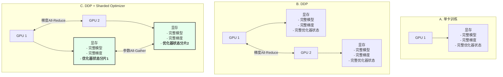

# 从0到1：揭秘分布式训练核心——DDP与Sharded Optimizer实现

## 引言

你是否曾面对过这样的困境：怀揣着一个绝妙的语言模型构想，却被单张GPU的显存限制和漫长的训练时间扼杀在摇篮里？当你尝试将模型扩展到处理海量数据时，训练过程是否变得举步维艰？

如果这些问题让你感同身受，那么恭喜你，这篇文章就是为你量身打造的。我们将一起踏上一段激动人心的旅程，深入探索一个名为 `llm-from-scratch` 的开源项目，它将向我们展示如何在PyTorch中从零开始实现分布式数据并行（DDP）和分片优化器（Sharded Optimizer）。读完本文，你不仅能理解这些看似高深的概念，更能掌握亲手实现它们的核心技巧，彻底告别单卡训练的瓶颈。


## 正文

### 单卡训练的瓶颈：一个人的晚餐派对

想象一下，你要举办一场盛大的晚宴，款待成百上千位客人。但厨房里只有你一个人，从备菜、烹饪到上菜，所有工作都得亲力亲为。结果可想而知：无论你多么努力，上菜速度都远远跟不上客人的需求，宴会变得一团糟。

单GPU训练语言模型就像这场一个人的晚餐派对。随着模型规模和数据量的爆炸式增长，一块GPU的计算能力和显存都显得捉襟见肘。我们面临两大核心痛点：

1.  **显存不足 (Out of Memory):** 巨大的模型参数和中间计算结果（梯度、优化器状态等）会轻易撑爆单张显卡的显存，导致训练根本无法启动。
2.  **训练缓慢 (Slow Training):** 即便显存勉强够用，海量数据的计算任务也让单个GPU不堪重负，训练过程可能需要数周甚至数月，这在快节奏的AI领域是无法接受的。

为了打破这个僵局，我们必须寻求“协作”的力量，邀请更多的“厨师”（GPU）加入这场派对。这就是分布式训练的由来。

### DDP：众人拾柴火焰高的分布式智慧

分布式数据并行（Distributed Data Parallel, DDP）是解决上述问题最经典、最有效的策略之一。它的核心思想简单而强大：**数据切分，模型复制，梯度同步**。

让我们用一个更生动的比喻来理解它：

> **DDP就像一个高效的建筑团队。**
> 
> 假设我们要建造一栋摩天大楼（训练一个大模型）。与其让一个建筑工（单GPU）独自搬运所有砖块（处理所有数据），我们雇佣了一个团队（多GPU）。
> 
> 1.  **任务分配（数据切分）**：我们将总的砖块（整个数据集）分成若干小堆，每个工人（GPU）负责自己面前的一堆。这样，所有工人可以同时开始搬砖，效率大大提升。
> 2.  **相同的蓝图（模型复制）**：每个工人都有一份完全相同的大楼设计蓝图（模型副本）。他们都知道每一块砖应该砌在哪个位置。
> 3.  **定期同步进度（梯度同步）**：在砌完一小部分墙体后（完成一个batch的前向和后向传播），所有工人会停下来开个短会。他们会汇总各自的工作成果（计算出的梯度），并根据综合结果（平均梯度）统一调整下一步的施工计划（更新模型参数）。
> 
> 通过这种方式，虽然每个工人只处理了一部分数据，但他们总能保持进度一致，共同协作，最终高效地建成整栋大楼。

`llm-from-scratch`项目中的`parallel/ddp.py`文件，正是对这套高效协作流程的精妙实现。


#### DDP实现的核心：`register_post_accumulate_grad_hook` 与梯度分桶

PyTorch为我们提供了一个强大的钩子（hook）——`register_post_accumulate_grad_hook`。这个钩子允许我们在特定张量的梯度计算完成并累积后，立即执行一个自定义函数。`llm-from-scratch`正是利用这个机制来触发梯度同步。

让我们深入代码，看看它是如何工作的：

```python
# file: parallel/ddp.py

class DDP(torch.nn.Module):
    def __init__(self, model: torch.nn.Module, bucket_size_mb: float = 128.0):
        super().__init__()
        self.module = model
        self.handles = []
        self.bucket_size = bucket_size_mb * 1024 * 1024
        self.grads_bucket = []
        self.size = 0
        for param in self.module.parameters():
            dist.broadcast(param.data, src=0) # 1. 初始化同步
            if param.requires_grad:
                param.register_post_accumulate_grad_hook(
                    lambda _, param=param: self._sync_gradients(param) # 2. 注册钩子
                )

    def _sync_gradients(self, p: torch.Tensor):
        if p.grad is not None:
            self.size += p.grad.numel() * p.grad.element_size()
            self.grads_bucket.append(p.grad)
            if self.size >= self.bucket_size: # 3. 梯度分桶
                self._sync_grads_in_buckets()

    def _sync_grads_in_buckets(self):
        if self.grads_bucket:
            flatten_grads = torch._utils._flatten_dense_tensors(self.grads_bucket)
            handle = dist.all_reduce(
                flatten_grads, op=dist.ReduceOp.AVG, async_op=True # 4. 异步All-Reduce
            )
            self.handles.append((handle, flatten_grads, list(self.grads_bucket)))
            self.size = 0
            self.grads_bucket.clear()

    def finish_gradient_sync(self):
        self._sync_grads_in_buckets() # 同步剩余的梯度
        for handle, _, _ in self.handles:
            handle.wait() # 5. 等待所有同步完成
        # ...后续梯度更新逻辑...
        self.handles.clear()
```

**代码解读:**

1.  **初始化同步 (`dist.broadcast`)**: 在DDP初始化时，确保所有GPU上的模型参数都从`rank 0`的进程复制而来，保证初始状态完全一致。
2.  **注册钩子**: 遍历模型中所有需要计算梯度的参数，并为它们一一注册钩子。一旦某个参数的梯度计算完成，`_sync_gradients`方法就会被自动调用。
3.  **梯度分桶 (Gradient Bucketing)**: 这是DDP实现中的一个关键优化。它并不会在每个梯度计算完成后都立刻进行通信，而是将梯度先收集到一个“桶”（`grads_bucket`）里。直到桶的大小达到预设阈值（`bucket_size`），才将桶内所有梯度“打包”成一个扁平的张量（`flatten_grads`），一次性进行通信。这大大减少了通信的频率，提高了网络带宽的利用效率，就像是快递员把一个小区的快递都收齐了再统一发车，而不是收一件发一件。
4.  **异步All-Reduce (`dist.all_reduce`)**: 这是分布式通信的核心操作。`all_reduce`会将所有GPU上的梯度张量进行规约操作（这里是求平均`AVG`），然后将结果分发回每个GPU。`async_op=True`参数让这个通信过程在后台异步执行，从而使得计算（后续层的梯度计算）和通信可以重叠（Overlap），进一步提升训练效率。
5.  **等待同步完成 (`handle.wait`)**: 在优化器更新参数之前（`optimizer.step()`之前），我们必须调用`finish_gradient_sync`来确保所有已触发的梯度同步操作都已完成。否则，模型参数的更新将基于不完整的梯度信息。

通过这套精巧的钩子和分桶机制，DDP实现了计算和通信的高效并行，让我们的“建筑团队”能够有条不紊、心有灵犀地协同工作。


### Sharded Optimizer：为显存“减负”的终极武器

DDP解决了计算效率的问题，让我们可以调动千军万马（多GPU）来加速训练。然而，它并没有完全解决显存的瓶颈。在DDP模式下，虽然数据被切分了，但**每个GPU上依然需要保留一份完整的模型副本，以及一份完整的优化器状态**（例如Adam优化器中的一阶和二阶动量）。对于动辄数百亿参数的模型，优化器状态本身就是一头“显存巨兽”，它的大小通常是模型参数的两倍（Adam需要保存两个状态），这使得DDP在训练超大规模模型时依然力不从心。

为了彻底攻克这个堡垒，`Sharded Optimizer`（分片优化器）应运而生，它的核心思想与DDP一脉相承，但更加激进：**不仅要将数据分片，还要将优化器状态也分片！**

> **Sharded Optimizer就像一个共享工具库的建筑团队。**
> 
> 在我们之前的建筑团队比喻中，每个工人（GPU）虽然只负责一部分砖块，但他们都配备了一整套重型机械（完整的优化器状态），比如起重机、挖掘机等，这非常占地方（显存）。
> 
> Sharded Optimizer引入了一个更聪明的资源管理模式：
> 
> 1.  **工具分发（优化器状态分片）**：我们不再给每个工人都配齐所有重型机械。而是将这些机械分成几组，每个工人（GPU）只保管其中的一小组。例如，工人A负责保管起重机，工人B负责挖掘机。
> 2.  **分工明确（分片更新）**：每个工人只使用自己保管的机械，来维护和更新他所负责的那部分楼层（模型参数子集）的建造状态。
> 3.  **全局同步（参数All-Gather）**：当所有工人完成一轮工作（`optimizer.step()`）后，他们不仅同步了工作成果（梯度），还会进行一次“工具状态广播”。工人A会把他更新后的起重机状态（更新后的参数）告诉所有人，工人B也会广播挖掘机的状态。这样，虽然每个工人只维护了一部分机械，但最终所有人都拥有了整栋大楼的最新、最完整的状态信息（同步后的完整模型参数）。

通过这种方式，每个GPU的显存负担被显著降低，因为它不再需要存储完整的优化器状态，而只需存储一个分片（Shard）。这使得我们能将省下来的宝贵显存用于容纳更大的模型，实现了“鱼和熊掌兼得”。

#### Sharded Optimizer实现剖析

`llm-from-scratch`中的`parallel/sharded_optimizer.py`为我们展示了如何优雅地实现一个分片优化器。它通过包装一个常规的PyTorch优化器（如`AdamW`）来实现其分片逻辑。

```python
# file: parallel/sharded_optimizer.py

class ShardedOptimizer(Optimizer):
    def __init__(self, params: Iterable[Dict], optimizer_cls: Type[Optimizer], **kwargs: Any):
        # ... 初始化rank, world_size等 ...
        self.rank = dist.get_rank()
        self.world_size = dist.get_world_size()
        super().__init__(params, kwargs)

    def add_param_group(self, param_group: Dict[str, Any]) -> None:
        full_params = list(param_group["params"])
        sharded_params = []
        for i, param in enumerate(full_params):
            if i % self.world_size == self.rank: # 1. 参数分片
                sharded_params.append(param)
        
        # ... 为底层的优化器创建分片的参数组 ...
        if not hasattr(self, "optimizer"):
            self.optimizer = self._optimizer_cls([sharded_param_group], **self._optimizer_kwargs)
        # ...

    @torch.no_grad()
    def step(self, closure: Optional[Callable] = None, **kwargs: Any) -> Optional[float]:
        # 在DDP中，梯度已经是同步过的，这里是为了兼容没有用DDP的场景
        self._average_gradients() 

        # 2. 只更新本地分片的参数
        loss = self.optimizer.step(closure, **kwargs)

        # 3. 将更新后的本地参数广播给所有其他GPU
        self._synchronize_parameters()

        return loss

    def _synchronize_parameters(self) -> None:
        if self.world_size == 1:
            return
        for group in self.param_groups:
            for i, p in enumerate(group["params"]):
                owner_rank = i % self.world_size
                dist.broadcast(p.data, src=owner_rank) # 4. All-Gather操作
```

**代码解读:**

1.  **参数分片**: 在`add_param_group`方法中，它并没有将所有参数都交给底层的优化器。而是根据当前GPU的`rank`，通过取模（`%`）的方式，只为自己分配一部分参数（`sharded_params`）。这意味着每个GPU上的底层优化器，只会创建和管理它所负责的那部分参数的优化器状态。
2.  **分片更新**: 在`step`方法中，当调用`self.optimizer.step()`时，实际上只更新了当前GPU负责的那部分参数。因为优化器只“看到”了这部分参数。
3.  **参数同步**: 在分片更新完成后，模型在不同GPU上的参数状态是不一致的（每个GPU只更新了一部分）。因此，必须调用`_synchronize_parameters`来将参数状态在所有GPU间进行同步。
4.  **All-Gather操作**: `_synchronize_parameters`的核心是`dist.broadcast`。它会遍历所有参数，并从拥有该参数最新状态的`owner_rank`那里，将参数值广播给其他所有进程。这一系列`broadcast`操作的组合，等效于一个`All-Gather`操作，最终确保了在`step`函数返回后，所有GPU上的模型参数副本都恢复到完全一致的状态，为下一次前向传播做好了准备。

### DDP vs. Sharded Optimizer：显存占用对比

为了更直观地展示Sharded Optimizer带来的显存节省效果，我们可以通过一个表格来对比不同策略下的显存构成（以4个GPU为例）：

| 显存占用项 | 标准单卡训练 (1 GPU) | DDP (4 GPUs) | DDP + Sharded Optimizer (4 GPUs) |
| :--- | :--- | :--- | :--- |
| **模型参数** | 1x | 每个GPU上 1x (共4x) | 每个GPU上 1x (共4x) |
| **梯度** | 1x | 每个GPU上 1x (共4x) | 每个GPU上 1x (共4x) |
| **优化器状态** | 1x | 每个GPU上 1x (共4x) | **每个GPU上仅 0.25x (共1x)** |
| **总显存（估算）** | `P + G + O` | `4 * (P + G + O)` | `4 * (P + G) + O` |
| **单个GPU显存** | `P + G + O` | `P + G + O` | **`P + G + O/4` (显著降低)** |

*P: 参数, G: 梯度, O: 优化器状态*

从表格中可以清晰地看到，Sharded Optimizer的核心优势在于将优化器状态的存储压力均摊到了所有GPU上，从而极大地降低了单个GPU的峰值显存占用。这正是我们能够训练更大模型的关键所在。

下面这张图可以帮助你更形象地理解三者之间的区别：



## 结论

从单卡训练的“独木难支”，到DDP的“众人拾柴”，再到Sharded Optimizer的“精兵简政”，我们一步步揭开了分布式训练的神秘面纱。通过`llm-from-scratch`这个项目，我们不仅理解了理论，更重要的是，我们看到了这些理论是如何通过清晰、优雅的代码落地生根的。

**核心要点回顾:**

*   **DDP** 通过“数据切分、模型复制、梯度同步”的策略，实现了训练任务在多GPU上的高效并行。
*   **梯度分桶** 和 **计算通信重叠** 是DDP实现中的关键性能优化技巧。
*   **Sharded Optimizer** 更进一步，通过将优化器状态分片，极大地降低了单个GPU的显存峰值，为训练千亿、万亿级别的大模型铺平了道路。

现在，你已经掌握了从0到1实现分布式训练的核心秘籍。不要犹豫，马上动手去 `llm-from-scratch` 的代码世界里探索一番，尝试在你的下一个项目中应用这些强大的技术吧！

最后，我想听听你的故事：在你的大模型训练之路上，还遇到过哪些有趣的挑战或独特的优化技巧？在评论区分享你的经验，让我们共同进步！
